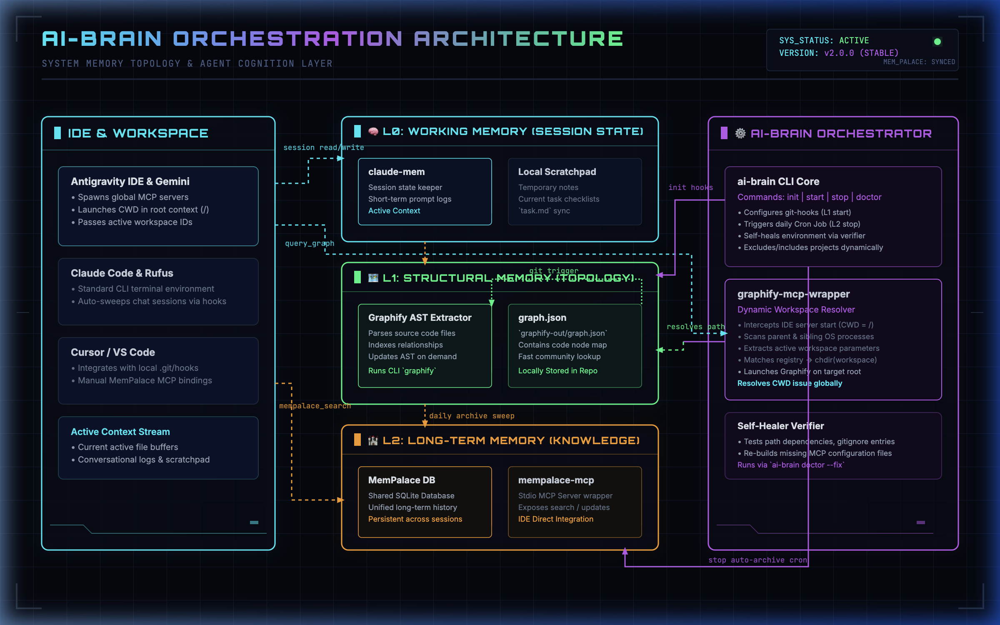

# AI Brain Orchestrator (ai-brain)

<p align="center">
  
  
  
  
</p>

> **AI Brain Orchestrator** — A unified CLI tool for AI agent memory management, codebase indexing, and multi-agent workspace synchronization.

`ai-brain` simplifies multi-agent development by packaging complex setup and routines for MemPalace, codebase-memory-mcp, and claude-mem into a single, cohesive command-line interface. It ensures that any AI agent entering your project (Claude Code, Rufus, Cursor, Gemini, Antigravity IDE, Codex, etc.) instantly understands your codebase structure, developer habits, and shares a persistent long-term memory palace.

---

## 🗺️ System Overview

`ai-brain` connects three distinct cognitive layers of memory to ensure that AI agents have full workspace awareness, code topography understanding, and historical context.

<p align="center">
  
</p>

### 🧠 Three-Layer Memory Architecture

| Layer | Tool | Purpose | Lifecycle | Target Size |
|:------|:-----|:--------|:----------|:------------|
| **L0** | `claude-mem` | **Working Memory** — session context, developer habits, task checkpoints | Session-bound | < 100KB |
| **L1** | `codebase-memory-mcp` | **Structural Memory** — code topology, call graphs, module dependencies | Project-bound, rebuildable | Per-project |
| **L2** | `mempalace` | **Long-term Memory** — conversations, decisions, debug experiences, lessons learned | Cross-project, permanent | < 500MB |

> **⚠️ Important**: Do NOT mine entire codebases into mempalace (L2). Code indexing belongs in L1 (`codebase-memory-mcp`). L2 is for **curated, high-value memories only** — conversations, architecture decisions, debug war stories. Use `ai-brain mine` to selectively add specific content.

---

## 🛠️ Prerequisites

Before installing `ai-brain`, make sure you have installed the core dependency tools via [uv](https://github.com/astral-sh/uv):

```bash
uv tool install mempalace --force
uv tool install claude-mem --force
uv tool install codebase-memory-mcp --force
```

---

## 🚀 Quick Start

### 1️⃣ Installation

Clone the repository and run the native installer to copy and configure `ai-brain` globally:

```bash
# Clone the repository
git clone git@github.com:yourusername/ai-brain.git ~/cwork/ai-brain

# Navigate and install
cd ~/cwork/ai-brain
./bin/ai-brain install
```

> [!NOTE]
> The installation copies the executable `ai-brain` to `~/.local/bin/`. Please ensure `~/.local/bin` is in your `PATH` environment variable. If not, append it to your Shell config (e.g., `~/.zshenv`):
> ```bash
> echo 'export PATH="$HOME/.local/bin:$PATH"' >> ~/.zshenv
> source ~/.zshenv
> ```

### 2️⃣ Initialize a Project

In any project workspace root, run the initialization command:

```bash
# Initialize core configurations, codebase index, and git hook bindings
ai-brain init

# OR initialize everything + register daily 23:30 auto-archive Cron Job
ai-brain full-init
```

---

## 📋 Commands Reference

| Command | Description | Recommended Usage | Safety |
| :--- | :--- | :--- | :--- |
| `init` | Initialize local wing configurations, codebase index, CLAUDE.md, and Git Hook bindings. | Run once per new project | ✅ Safe |
| `full-init` | Perform `init` plus register the global daily auto-archive Cron Job at 23:30. | Run once per system setup | ✅ Safe |
| `install` | Install/update the executable shims to `~/.local/bin/` and verify PATH. | Run on setup/update | ✅ Safe |
| `update` | Alias for `install` (supports auto Git-pull and copy-updating from the cloned source repo). | Run to update | ✅ Safe |
| `start` | Generate or update the latest codebase architecture maps. | Runs automatically via Git Hooks | ✅ Safe |
| `stop` | Safe scan, sweep, and archive of the day's local chat context to the long-term SQLite memory palace. | Run at end of day | ✅ Safe |
| `status` | Print current project memory status (MemPalace, Codebase-Memory, CLAUDE.md, Auto-Archive). | Run for diagnostics | 🔍 Read-only |
| `verify` | Perform a comprehensive 9-point system check of all memory tools and IDE bindings. | Run to troubleshoot | 🔍 Read-only |
| `doctor` | Perform comprehensive diagnostics (check gitignore, stale locks, CLI paths) across all projects. | Run for deep troubleshooting | 🔍 Read-only |
| `doctor --fix` | Diagnoses and auto-fixes configuration errors, updating obsolete cognitive rules in CLAUDE.md files. | Run to auto-heal system | 🔧 Modifying |
| `list` | Show auto-archive status of all registered active projects in the system. | Run to see project list | 🔍 Read-only |
| `remove [key]` | Remove/deregister a project (by index or keyword) from the active registry list. | Run to clean active list | 🗑️ Destructive |
| `version` | Display the installed version of `ai-brain`. | Run to check version | 🔍 Read-only |
| `clean` | Remove all local `ai-brain` configuration directories, map directories, and Git hooks. | Run to strip configuration | 🗑️ Destructive |
| `uninstall` | Global removal of all local configurations, registered Cron Jobs, global executables, and MCP server listings. | Run to completely uninstall | 🗑️ Destructive |

### 🗂️ Auto-Archive Whitelisting
To prevent memory conflicts, projects are **excluded** from auto-archiving by default. Manage your whitelisted projects using:

```bash
ai-brain include           # Enable auto-archiving for the current project
ai-brain exclude           # List all registered active projects and whitelisting status
ai-brain exclude current   # Disable auto-archiving for the current project
ai-brain include-all       # Enable auto-archiving for all registered active projects
ai-brain exclude-all       # Disable auto-archiving for all registered active projects
ai-brain list              # List all registered projects with their auto-archive status
ai-brain remove [key]      # Deregister a project from the system (accepts index, keyword, or all)
```

---

## 💡 Editor Integrations

- **Claude Code / Rufus / OpenClaw**: Automatically registered on `full-init` via stdio command configuration.
- **Gemini / Antigravity IDE / OpenCode**: Registered in `~/.gemini/config/mcp_config.json` and `~/.mcp.json` to launch `codebase-memory-mcp` as a stdio server.
- **Codex Agent**: TOML configuration is automatically managed at `~/.codex/config.toml` to register stdio-based MCP servers.
- **Cursor / VS Code / Claude Desktop**: Integrates with local `.git/hooks`, `CLAUDE.md`, and `.codebase-memory/` automatically, registering the MCP server for agent-wide context search.

---

## 📖 SOP Guidelines

For detailed step-by-step cognitive routines, workflows, database deadlock prevention rules, and agent guidelines, refer to the [AI Agent Orchestration SOP](docs/AI_Agent_Orchestration_SOP.md).

---

## 📄 License

This project is open-sourced under the [MIT License](LICENSE).
