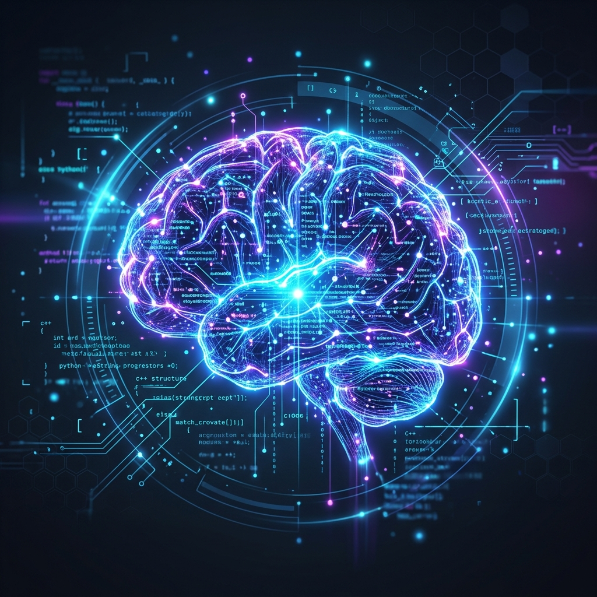

# 🧠 ai-brain

<p align="center">
  
</p>

> **AI Brain Orchestrator** — A unified CLI tool for AI agent memory management, codebase indexing, and multi-agent workspace synchronization.

<p align="center">
  
  
  
  
</p>

`ai-brain` simplifies multi-agent development by packaging complex setup and routines for MemPalace, Graphify, and claude-mem into a single, cohesive command-line interface. It ensures that any AI agent entering your project (Claude Code, Rufus, Cursor, Gemini, Antigravity IDE, etc.) instantly understands your codebase structure, developer habits, and shares a persistent long-term memory palace.

---

## 🗺️ System Overview

`ai-brain` connects three distinct cognitive layers of memory to ensure that AI agents have full workspace awareness, code topography understanding, and historical context.

<p align="center">
  
</p>

---

## 🧠 Dynamic Workspace Detection (MCP Wrapper)

For global MCP servers launched by IDEs (like Antigravity IDE) where the default working directory is set to `/`, `ai-brain` automatically registers and installs the custom `graphify-mcp-wrapper` to resolve the active workspace path on the fly.

### 🔄 Resolution Lifecycle & Flow

1. **Spawn Request** 🚀
   Antigravity IDE spawns the global `graphify-mcp-wrapper` executable with the current working directory (`CWD`) set to `/`.
2. **Process Analysis** 🔍
   The wrapper scans the active operating system processes to locate the parent IDE Extension Host and its sibling processes (`language_server_macos_arm`).
3. **Parameter Extraction** 🧬
   It parses the process arguments to extract the active workspace identifier (e.g., `--workspace_id file_Users_carlos_cwork_ai-brain`).
4. **Registry Matching** 🗺️
   It decodes and matches the workspace ID against registered active projects inside the centralized registry (`~/.claude/ai_brain_active_projects.txt`).
5. **Context Switch** ⚙️
   The wrapper dynamically switches the active working directory of the process (`chdir`) to the matching project root.
6. **Server Handover** 🤝
   It launches the standard `graphify` service, ensuring the IDE can seamlessly query the AST codebase topology of the active workspace.

---

## 🛠️ Prerequisites

Before installing `ai-brain`, make sure you have installed the core dependency tools via [uv](https://github.com/astral-sh/uv):

```bash
uv tool install mempalace --force
uv tool install claude-mem --force
uv tool install graphifyy --force
```

---

## 🚀 Quick Start

### 1️⃣ Installation

Clone the repository and run the native installer to copy and configure `ai-brain` globally:

```bash
# Clone the repository
git clone git@github.com:yourusername/ai-brain.git ~/cwork/ai-brain

# Navigate and install
cd ~/cwork/ai-brain
./bin/ai-brain install
```

> [!NOTE]
> The installation copies the scripts (`ai-brain` and `graphify-mcp-wrapper`) to `~/.local/bin/`. Please ensure `~/.local/bin` is in your `PATH` environment variable. If not, append it to your Shell config (e.g., `~/.zshenv`):
> ```bash
> echo 'export PATH="$HOME/.local/bin:$PATH"' >> ~/.zshenv
> source ~/.zshenv
> ```

### 2️⃣ Initialize a Project

In any project workspace root, run the initialization command:

```bash
# Initialize core configurations, Graphify rules, and git hook bindings
ai-brain init

# OR initialize everything + register daily 23:30 auto-archive Cron Job
ai-brain full-init
```

---

## 📋 Commands Reference

| Command | Description | Recommended Usage | Safety |
| :--- | :--- | :--- | :--- |
| `init` | Initialize local wing configurations, Graphify rules, CLAUDE.md, and Git Hook bindings. | Run once per new project | ✅ Safe |
| `full-init` | Perform `init` plus register the global daily auto-archive Cron Job at 23:30. | Run once per system setup | ✅ Safe |
| `install` | Install/update the executable shims to `~/.local/bin/` and verify PATH. | Run on setup/update | ✅ Safe |
| `update` | Alias for `install` (supports auto Git-pull and copy-updating from the cloned source repo). | Run to update | ✅ Safe |
| `start` | Generate or update the latest codebase architecture maps. | Runs automatically via Git Hooks | ✅ Safe |
| `stop` | Safe scan, sweep, and archive of the day's local chat context to the long-term SQLite memory palace. | Run at end of day | ✅ Safe |
| `status` | Print current project memory status (MemPalace, Graphify, CLAUDE.md, Auto-Archive). | Run for diagnostics | 🔍 Read-only |
| `verify` | Perform a comprehensive 9-point system check of all memory tools and IDE bindings. | Run to troubleshoot | 🔍 Read-only |
| `doctor` | Perform comprehensive workspace diagnostics (check gitignore, stale locks, CLI path access, etc.) | Run for deep troubleshooting | 🔍 Read-only |
| `doctor --fix` | Diagnoses and automatically repairs any configuration issues (gitignore entries, mempalace rooms, active locks, missing MCP settings) | Run to auto-heal system | 🔧 Modifying |
| `version` | Display the installed version of `ai-brain`. | Run to check version | 🔍 Read-only |
| `clean` | Remove all local `ai-brain` configuration directories, map directories, and Git hooks. | Run to strip configuration | 🗑️ Destructive |
| `uninstall` | Global removal of all local configurations, registered Cron Jobs, global executables, and MCP server listings. | Run to completely uninstall | 🗑️ Destructive |

### 🗂️ Auto-Archive Whitelisting
To prevent memory conflicts, projects are **excluded** from auto-archiving by default. Manage your whitelisted projects using:

```bash
ai-brain include           # Enable auto-archiving for the current project
ai-brain exclude           # List all registered active projects and whitelisting status
ai-brain exclude current   # Disable auto-archiving for the current project
ai-brain include-all       # Enable auto-archiving for all registered active projects
ai-brain exclude-all       # Disable auto-archiving for all registered active projects
```

---

## 🦾 Editor Integrations

- **Claude Code / Rufus / OpenClaw**: Automatically registered on `full-init` via stdio command configuration.
- **Gemini / Antigravity IDE / OpenCode**: Registered in `~/.gemini/config/mcp_config.json` and `~/.mcp.json`. It automatically configures and uses `graphify-mcp-wrapper` as the MCP command for `graphify` to dynamically detect and resolve active project workspace paths (CWD).
- **Cursor / VS Code**: Integrates with local `.git/hooks`, `CLAUDE.md`, and `graphify-out/` automatically. To add the Memory Palace MCP server manually, navigate to `Settings` -> `Features` -> `MCP` and add a new stdio command Server targeting `mempalace-mcp`.

---

## 📖 SOP Guidelines

For detailed step-by-step cognitive routines, workflows, database deadlock prevention rules, and agent guidelines, refer to the [AI Agent Orchestration SOP](docs/AI_Agent_Orchestration_SOP.md).

---

## 📄 License

This project is open-sourced under the [MIT License](LICENSE).
