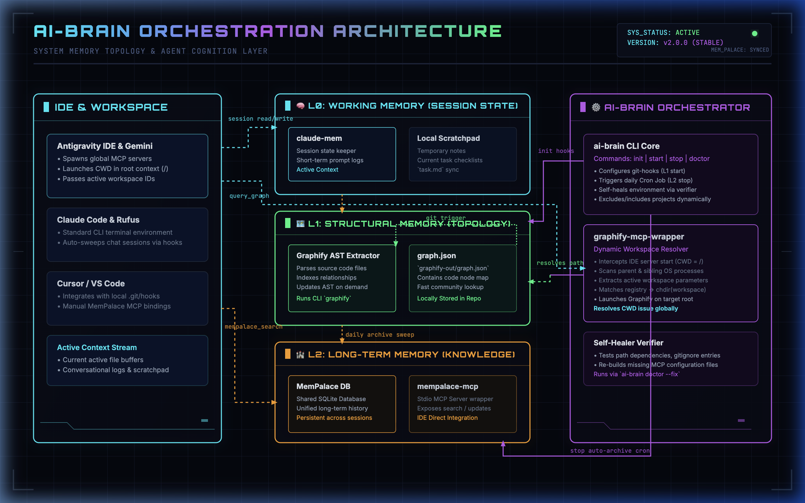

# AI Brain Orchestrator (ai-brain)

<p align="center">
  
  
  
  
</p>

> **AI Brain Orchestrator** — A unified CLI tool for AI agent memory management, codebase indexing, and multi-agent workspace synchronization.

`ai-brain` simplifies multi-agent development by packaging complex setup and routines for MemPalace, codebase-memory-mcp, and claude-mem into a single, cohesive command-line interface. It ensures that any AI agent entering your project (Claude Code, Rufus, Cursor, Gemini, Antigravity IDE, Codex, etc.) instantly understands your codebase structure, developer habits, and shares a persistent long-term memory palace.

---

## 🗺️ System Overview

`ai-brain` connects three distinct cognitive layers of memory to ensure that AI agents have full workspace awareness, code topography understanding, and historical context.

<p align="center">
  
</p>

### 🧠 Three-Layer Memory Architecture

| Layer | Tool | Purpose | Lifecycle | Target Size |
|:------|:-----|:--------|:----------|:------------|
| **L0** | `claude-mem` | **Working Memory** — session context, developer habits, task checkpoints | Session-bound | < 100KB |
| **L1** | `codebase-memory-mcp` | **Structural Memory** — code topology, call graphs, module dependencies | Project-bound, rebuildable | Per-project |
| **L2** | `mempalace` | **Long-term Memory** — conversations, decisions, debug experiences, lessons learned | Cross-project, permanent | < 500MB |

> **⚠️ Important**: Do NOT mine entire codebases into mempalace (L2). Code indexing belongs in L1 (`codebase-memory-mcp`). L2 is for **curated, high-value memories only** — conversations, architecture decisions, debug war stories. Use `ai-brain mine` to selectively add specific content.

---

## 🛠️ Prerequisites

Before installing `ai-brain`, make sure you have installed the core dependency tools via [uv](https://github.com/astral-sh/uv):

```bash
uv tool install mempalace --force
uv tool install claude-mem --force
uv tool install codebase-memory-mcp --force
```

---

## 🚀 Quick Start

### 1️⃣ Installation

Clone the repository and run the native installer to copy and configure `ai-brain` globally:

```bash
# Clone the repository
git clone git@github.com:yourusername/ai-brain.git ~/cwork/ai-brain

# Navigate and install
cd ~/cwork/ai-brain
./bin/ai-brain install
```

> [!NOTE]
> The installation copies the executable `ai-brain` to `~/.local/bin/`. Please ensure `~/.local/bin` is in your `PATH` environment variable. If not, append it to your Shell config (e.g., `~/.zshenv`):
> ```bash
> echo 'export PATH="$HOME/.local/bin:$PATH"' >> ~/.zshenv
> source ~/.zshenv
> ```

### 2️⃣ Initialize a Project

In any project workspace root, run the initialization command:

```bash
# Fully automatic initialization + enable auto-archiving (recommended)
ai-brain init -a

# Fully automatic initialization (registers background Git Hooks and auto-archive Cron, but project excluded from archiving by default)
ai-brain init

# OR standard manual initialization (requires manually running start/stop)
ai-brain init -m
```

---

## 📋 Commands Reference (GitHub Standard CLI Format)

`ai-brain` uses GitHub CLI (`gh`) standard conventions: **`ai-brain <noun> <verb> [flags]`**, while maintaining 100% backward compatibility for top-level shortcuts.

### 📦 Project Management (`project`)
| Command | Alias | Description | Safety |
| :--- | :--- | :--- | :--- |
| `ai-brain project init [-a\|-m]` | `ai-brain init` | Initialize project brain, memory wing, `.claude/CLAUDE.md`, and Git Hooks. (`-a` enables auto-archiving). | ✅ Safe |
| `ai-brain project list` | `ai-brain list` | List all registered active projects and auto-archive status. | 🔍 Read-only |
| `ai-brain project include [key]` | `ai-brain include` | Enable auto-archiving for a specific project or current directory. | ✅ Safe |
| `ai-brain project exclude [key]` | `ai-brain exclude` | Disable auto-archiving for a specific project or current directory. | ✅ Safe |
| `ai-brain project remove [key]` | `ai-brain remove` | Deregister a project from the active registry list. | 🗑️ Destructive |
| `ai-brain project status` | `ai-brain status` | Show current workspace brain health and ChromaDB capacity status. | 🔍 Read-only |
| `ai-brain project clean` | `ai-brain clean` | Remove local `.ai-brain` configuration, maps, and Git hooks. | 🗑️ Destructive |

### 🧠 Memory Operations (`memory`)
| Command | Alias | Description | Safety |
| :--- | :--- | :--- | :--- |
| `ai-brain memory start` | `ai-brain start` | Refresh codebase architecture map and L1 graph topology. | ✅ Safe |
| `ai-brain memory stop` | `ai-brain stop` | Safely package and archive session conversations into L2 memory palace. | ✅ Safe |
| `ai-brain memory mine [target]` | `ai-brain mine` | Selectively mine high-value content (chats, ADRs, docs) into L2 palace. | ✅ Safe |
| `ai-brain memory sync [--fix]` | `ai-brain mcp-sync` | Check and auto-sync MCP server binary paths across all IDE configs. | 🔧 Modifying |
| `ai-brain memory gc [--apply]` | `ai-brain gc` | Garbage-collect drift backups and compress ChromaDB database. | 🔧 Modifying |

### 🛠️ System & Diagnostics (`system`)
| Command | Alias | Description | Safety |
| :--- | :--- | :--- | :--- |
| `ai-brain system doctor [--fix]` | `ai-brain doctor` | Comprehensive health check across all projects, database locks, and rules. | 🔧 Modifying |
| `ai-brain system verify` | `ai-brain verify` | One-click 14-point diagnostic of memory tools, plugins, and daemons. | 🔍 Read-only |
| `ai-brain system install` | `ai-brain install` | Install or update executable shims in `~/.local/bin` and verify PATH. | ✅ Safe |
| `ai-brain system update` | `ai-brain update` | Git-pull latest source repo and update global `ai-brain` installation. | ✅ Safe |
| `ai-brain system config global` | `ai-brain config` | View or configure global AI brain preferences and override rules. | ✅ Safe |
| `ai-brain system uninstall` | `ai-brain uninstall` | Complete global removal of configurations, Cron jobs, and MCP bindings. | 🗑️ Destructive |

---

## 🤖 Supported Agent Tools & Configuration Targets

`ai-brain` automatically manages, registers, and diagnoses memory layer configurations across the following 10 supported AI Agent Tools and IDE environments:

| Agent / IDE Tool | Config Location(s) | Target Key | Auto-Configured Services | Context Files (`AGENTS.md` / `CLAUDE.md`) |
| :--- | :--- | :--- | :--- | :--- |
| **Claude Code / Rufus** | `~/.claude.json`<br>`~/.claude/settings.json`<br>`~/.claude/*_settings.json` (SSH Remote) | `mcpServers` | `mempalace`<br>`codebase-memory-mcp`<br>`claude-mem` | ✅ Natively supported |
| **Gemini / Antigravity IDE** | `~/.gemini/config/mcp_config.json`<br>`~/.gemini/antigravity/mcp_config.json` | `mcpServers` | `mempalace`<br>`codebase-memory-mcp`<br>`claude-mem` | ✅ Natively supported |
| **Pi Agent (`pi`)** | `~/.pi/agent/mcp.json` | `mcpServers` | `mempalace`<br>`codebase-memory-mcp`<br>`claude-mem` | ✅ Natively supported |
| **OpenCode** | `~/.config/opencode/opencode.json` | `mcp` | `mempalace`<br>`codebase-memory-mcp`<br>`claude-mem` | ✅ Natively supported |
| **OpenClaw** | `~/.openclaw/openclaw.json` | `mcp.servers` | `mempalace`<br>`codebase-memory-mcp`<br>`claude-mem` | ✅ Natively supported |
| **Codex Agent** | `~/.codex/config.toml` | `mcp_servers` | `mempalace`<br>`codebase-memory-mcp`<br>`claude-mem` | ✅ Natively supported |
| **Cursor** | `~/.cursor/mcp.json` | `mcpServers` | `mempalace`<br>`codebase-memory-mcp`<br>`claude-mem` | ✅ Natively supported |
| **Kilo Code (VS Code & CLI)** | `~/.config/kilo/kilo.json`<br>`kilocode.kilo-code/settings/mcp_settings.json` | `mcp` / `mcpServers` | `mempalace`<br>`codebase-memory-mcp`<br>`claude-mem` | ✅ Natively supported |
| **Claude Desktop App** | `claude_desktop_config.json` | `mcpServers` | `mempalace`<br>`codebase-memory-mcp`<br>`claude-mem` | N/A |
| **Generic MCP Clients** | `~/.mcp.json` | `mcpServers` | `mempalace`<br>`codebase-memory-mcp`<br>`claude-mem` | N/A |

---

## 📖 SOP Guidelines

For detailed step-by-step cognitive routines, workflows, database deadlock prevention rules, and agent guidelines, refer to the [AI Agent Orchestration SOP](docs/AI_Agent_Orchestration_SOP.md).

---

## 📄 License

This project is open-sourced under the [MIT License](LICENSE).
