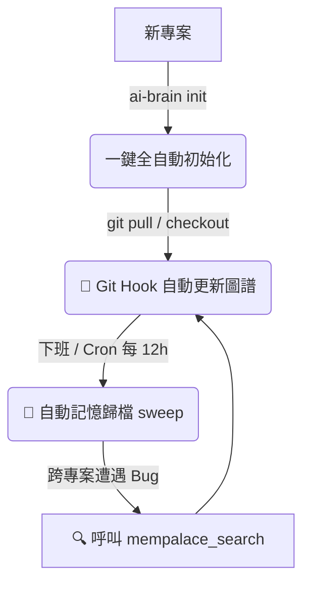

# 🧠 AI 代理極簡化協作與記憶同步 SOP

> **本文件目標**：讓任何 AI Agent（Claude Code、OpenClaw、OpenCode、Cursor、Gemini / Antigravity IDE）在進入一個專案時，能自動判斷是否需要安裝 AI 大腦工具鏈，並完成配置。

## 🤖 Agent 快速決策流程

當你（AI Agent）進入一個新專案時，按以下步驟判斷：

### Step 1：檢測 ai-brain 是否已安裝

```bash
# 檢測全域指令是否存在
command -v ai-brain 2>/dev/null && echo "INSTALLED" || echo "NOT_INSTALLED"

# 檢測全域指令的軟連結來源
ls -la $(which ai-brain) 2>/dev/null
```

| 結果                                                  | 下一步                                          |
| :---------------------------------------------------- | :---------------------------------------------- |
| `NOT_INSTALLED`                                       | 跳到「第一部分：全域安裝」                      |
| `INSTALLED` + 專案已有 `.codebase-memory/`              | 直接開始開發（參考「第二部分：日常指令」）        |
| `INSTALLED` + 專案沒有 `.codebase-memory/`            | 執行 `ai-brain init`（參考「第二部分：初始化」）  |

### Step 2：檢測專案是否已初始化

```bash
# 檢查專案大腦配置是否存在
[ -d ".codebase-memory" ] && echo "INITIALIZED" || echo "NOT_INITIALIZED"
```

| 結果                                                  | 動作                                                                |
| :---------------------------------------------------- | :------------------------------------------------------------------ |
| `NOT_INITIALIZED`                                     | 執行 `ai-brain init`（全自動配置）或 `ai-brain init -m`（標準/手動配置） |
| `INITIALIZED`                                         | 檢查是否有 `.mempalace` 或 `mempalace.json`；若無，執行 `ai-brain init` |

### Step 3：檢測依賴套件是否可用

```bash
# 快速三合一檢查
for cmd in mempalace claude-mem codebase-memory-mcp; do
  command -v "$cmd" &>/dev/null && echo "✅ $cmd OK" || echo "❌ $cmd MISSING"
done
```

| 缺少套件      | 安裝指令                                                         |
| :------------ | :--------------------------------------------------------------- |
| mempalace     | `uv tool install mempalace --force`                              |
| claude-mem    | `uv tool install claude-mem --force`                             |
| codebase-memory-mcp | `uv tool install codebase-memory-mcp --force`                       |
| uv 本身       | [uv 安裝指南](https://docs.astral.sh/uv/getting-started/installation/) |

### Step 4：Linux 環境注意 — PATH 配置

若工具已安裝但 `command -v ai-brain` 回報找不到，檢查 `~/.local/bin` 是否在 `$PATH`：

```bash
echo $PATH | tr ':' '\n' | grep '.local/bin' || echo "NOT IN PATH"
```

若不在 PATH，需加入 `~/.zshenv`：

```bash
# macOS / Linux 通用：確保 ~/.local/bin 在所有 Shell 場景可用
echo 'export PATH="$HOME/.local/bin:$PATH"' >> ~/.zshenv
source ~/.zshenv
```

---

## 🛠️ 第一部分：一次性全域配置 (只需設定一次)

全域配置會為您的作業系統安裝大腦核心套件，並將 `ai-brain` 軟連結至系統 `PATH`，讓您在任何專案根目錄均可直接呼叫。

### 1️⃣ 安裝核心 CLI 工具
使用 `uv` 進行安全隔離的全域工具安裝：
```bash
uv tool install mempalace --force
uv tool install claude-mem --force
uv tool install codebase-memory-mcp --force
```

### 2️⃣ 建立全域 ai-brain 指令軟連結

腳本位於 `PC/Knowhow/ai-brain.sh`。建立全域軟連結：

```bash
# 在筆記專案根目錄執行
chmod +x PC/Knowhow/ai-brain.sh
ln -sf "$(pwd)/PC/Knowhow/ai-brain.sh" ~/.local/bin/ai-brain
```

> **驗證安裝成功**：`ai-brain verify` 應顯示 7 項全 ✅。

### 3️⃣ 註冊全域 MCP 伺服器

| 平台                         | 指令                                                                                        |
| :--------------------------- | :------------------------------------------------------------------------------------------ |
| Claude Code / OpenClaw / Rufus | `claude mcp add mempalace -- mempalace-mcp`                                                |
| OpenCode                     | 自動寫入 `~/.mcp.json`                                                                      |
| Gemini / Antigravity IDE     | 寫入 `~/.gemini/config/mcp_config.json`（`ai-brain init` 自動處理，或手動執行 python3 寫入）        |
| Cursor                       | Settings → Features → MCP → Add Server → Name: `mempalace`, Type: `command`, Command: `mempalace-mcp` |

---

## 🚀 第二部分：極簡日常開發流程



### 📦 一次性專案初始化 (僅在新專案執行一次)

```bash
# 在專案根目錄執行
ai-brain init
```

| 指令                    | 差異                                                                                |
| :---------------------- | :------------------------------------------------------------------ |
| `ai-brain init`         | 全自動配置（含 Wing、.claude/CLAUDE.md、Git Hooks、以及全域 23:30 自動歸檔 Cron Job） |
| `ai-brain init -m`      | 標準手動配置（僅 Wing、.claude/CLAUDE.md、Git Hooks，❌ 無自動歸檔排程）            |

> **`ai-brain init` 全自動完成的事**：
> - 🔗 MemPalace Wing 配置
> - 🗺️ codebase-memory-mcp 專案地圖準備
> - 🧠 .claude/CLAUDE.md 大腦導航手冊
> - 🎣 `.git/hooks/post-merge` + `post-checkout` 綁定
> - ⏰ 全域 Cron Job 註冊（每天晚上 23:30 自動記憶歸檔）
>
> **注意**：新專案預設 **不自動歸檔**（安全策略）。若要啟用，請執行 `ai-brain include`。

### 🌅 每日早晨：啟動開發

- **無感自動**：`git pull` 或 `git checkout` 時，Git Hook 自動重建圖譜
- **手動更新**：
  ```bash
  ai-brain start
  ```

### 🌇 下班收尾

先關閉所有 AI 視窗與終端機，再執行：
```bash
ai-brain stop
```

背後觸發 `mempalace sweep`，僅對 **白名單中啟用** 的專案進行歸檔。

---

## ⚙️ 第三部分：維護、健康診斷與清理

### 📊 狀態檢查

```bash
ai-brain status    # 查看當前專案配置狀態
ai-brain verify    # 全域 7 項健康檢查（7 項全 ✅ = 完美）
```

### ⏰ Cron Job 管理

```bash
ai-brain stop-cron    # 停止全域自動歸檔 Cron Job
```

### 🗂️ 自動歸檔白名單管理

系統預設 **不自動歸檔**。以下指令管理哪些專案啟用定時歸檔：

```bash
ai-brain exclude           # 查看歸檔狀態清單
ai-brain include           # 啟用當前專案自動歸檔
ai-brain exclude current   # 停用當前專案自動歸檔
ai-brain include pywork    # 啟用指定專案（關鍵字匹配）
ai-brain exclude pywork    # 停用指定專案
ai-brain include-all       # 全部啟用
ai-brain exclude-all       # 全部停用
```

### 🗑️ 清理與卸載

```bash
ai-brain clean       # 清除當前專案大腦配置（mempalace.yaml, .codebase-memory/, .claude/, git hooks）
ai-brain uninstall   # 全域卸載（專案清理 + Cron + 軟連結 + MCP 登出）
```

---

## 📋 指令速查表

| 指令                 | 場景                           | 安全等級        |
| :------------------- | :----------------------------- | :-------------- |
| `ai-brain init`      | 新專案全自動初始化 (+ Cron)     | ✅ 安全          |
| `ai-brain init -m`   | 新專案標準手動初始化 (無 Cron)  | ✅ 安全          |
| `ai-brain start`     | 重建代碼圖譜                   | ✅ 安全          |
| `ai-brain stop`      | 記憶歸檔                       | ✅ 安全          |
| `ai-brain status`    | 查看狀態                       | 🔍 只讀          |
| `ai-brain verify`    | 健康檢查                       | 🔍 只讀          |
| `ai-brain include`   | 啟用自動歸檔                   | ✅ 安全          |
| `ai-brain exclude`   | 停用自動歸檔                   | ✅ 安全          |
| `ai-brain stop-cron` | 停止全域排程                   | ⚠️ 影響全域      |
| `ai-brain clean`     | 清除專案配置                   | 🗑️ 不可逆        |
| `ai-brain uninstall` | 全域卸載                       | 🗑️ 不可逆        |

---

## 🗂️ 第四部分：多專案並行開發之記憶管理策略

| 層級             | 範圍                  | 隔離性                           |
| :--------------- | :-------------------- | :------------------------------- |
| 短期/習慣記憶    | `.claude/config.json` | 100% 物理隔離（每專案獨立）      |
| 長期記憶宮殿     | 全域 SQLite           | 跨專案完全共享（跨專案知識檢索） |

> [!WARNING]
> **資料庫死鎖防護**：避免在多個 Agent 同時運作時手動執行 `sweep`。Cron Job（每 12 小時）與晨間背景自癒 sweeps 只在系統安靜無併發讀寫時執行。

---

## 💻 第五部分：Cursor 編輯器配置指南
1. Cursor 會自動讀取專案內的 `.claude/CLAUDE.md` 與 `.codebase-memory/`，不需額外設定
2. MCP 註冊：Settings → Features → MCP → Add Server → `mempalace` / `command` / `mempalace-mcp`

---

## 💻 第六部分：Gemini / Antigravity IDE 編輯器配置指南

1. **共享長期記憶機制**：
   - Gemini / Antigravity IDE 採用 `~/.gemini/config/mcp_config.json` 作為 MCP 設定檔來源（OpenCode 則使用 `~/.mcp.json`）。
   - `ai-brain init` 會自動偵測 `~/.gemini/` 目錄是否存在，若存在則自動寫入 `mcp_config.json`，完成後即可與 Claude Code / OpenCode 共享同一長期記憶資料庫。

2. **驗證記憶載入狀態**：
   - 在專案中執行 `ai-brain verify`，當 `7. 檢查 Gemini / Antigravity IDE 與 MCP 記憶載入` 顯示 `[ OK ]` 時，代表 IDE 已可呼叫長期記憶套件。
   - 遇到跨專案 Bug 或需尋求歷史紀錄時，請主動於本 IDE 對話中調用 `mempalace_search` 工具，以拉取跨 Session 記憶。

---

## 🧠 第七部分：AI 代理認知工作流

```
+─────────────────────────────────────────────────────────────+
|                 AI Agent 的四段式認知循環模型                |
+─────────────────────────────────────────────────────────────+

  【1. 啟動與導航】 ───►  讀取 .claude/CLAUDE.md  ───►  加載 codebase-memory-mcp 圖譜
  【2. 執行與約束】 ───►  遵循 claude-mem  ─────► 保持開發習慣與防失憶壓縮
  【3. 遭遇未知/排錯】 ──► 調用 mempalace_search ──► 跨專案檢索知識
  【4. 下班後沉澱】 ───►  mempalace sweep  ─────► 短期對話日誌 ──► 永久事實
```

---

*最後更新時間：2026-07-02*  
*設計者：Antigravity*
