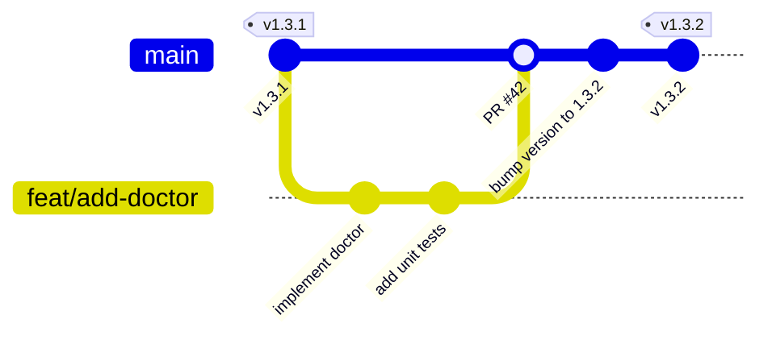

# Development & Release Guidelines

This guide details the git workflow, versioning strategy, and automated release pipeline for the `ai-brain` project.

---

## 1. Development Workflow

We follow a structured branching strategy to maintain code quality and pipeline stability:



1. **Branch Protection**: The `main` branch is protected. Direct pushes to `main` are restricted for feature development.
2. **Feature Branches**: All feature additions, refactors, and bug fixes must be developed in branch names following:
   - `feat/feature-name`
   - `fix/bug-name`
   - `docs/doc-updates`
3. **Pull Requests (PR)**:
   - When feature development is complete, open a PR to merge into `main`.
   - Creating a PR automatically runs the **GitHub CI** workflow (`ci.yml`) across Python versions 3.8 to 3.12.
   - Merge the PR once CI passes and review is completed.

---

## 2. Versioning Strategy

This project uses [Semantic Versioning (SemVer)](https://semver.org/): `MAJOR.MINOR.PATCH`

* **MAJOR**: Incompatible API changes.
* **MINOR**: Backward-compatible functionality additions (e.g., adding a new CLI subcommand).
* **PATCH**: Backward-compatible bug fixes and documentation cleanup.

### How to Bump Version

Before releasing, you must increment the version in the following files:

1. **[pyproject.toml](file:///Users/carlos/cwork/ai-brain/pyproject.toml)**:
   ```toml
   [project]
   version = "X.Y.Z"
   ```
2. **[constants.py](file:///Users/carlos/cwork/ai-brain/src/ai_brain/constants.py)**:
   ```python
   VERSION = "X.Y.Z"
   ```

Commit the version bump:
```bash
git add pyproject.toml src/ai_brain/constants.py
git commit -m "bump version to X.Y.Z"
git push origin main
```

---

## 3. Automated Release Pipeline

When you push a tag matching `v*`, the **GitHub Release** workflow (`release.yml`) is triggered automatically.

### Release Steps

1. **Checkout the latest main branch**:
   ```bash
   git checkout main
   git pull origin main
   ```
2. **Create a local tag**:
   ```bash
   git tag vX.Y.Z
   ```
3. **Push the tag**:
   ```bash
   git push origin vX.Y.Z
   ```

### What Happens in CI/CD

1. **Testing**: Runs the Python unit test suite.
2. **Build**: Builds the source distribution (`.tar.gz`) and wheel package (`.whl`).
3. **Draft Release**: Automatically publishes a GitHub Release under the pushed tag, containing auto-generated release notes, changelogs, and attached build assets.
4. **PyPI (Optional)**: If PyPI Trusted Publishers are configured, the pipeline publishes the new package directly to PyPI.

---

## 4. Local Building & Diagnostics

To build the packages locally for verification:

```bash
# Install build tool
python -m pip install --upgrade build

# Build package
python -m build
```

This generates `.tar.gz` and `.whl` files in the `dist/` directory.

To run diagnostics and verify the health of your local AI brain workspace:
```bash
# Comprehensive diagnosis
ai-brain doctor

# Self-healing and auto-fixing configuration issues
ai-brain doctor --fix
```
